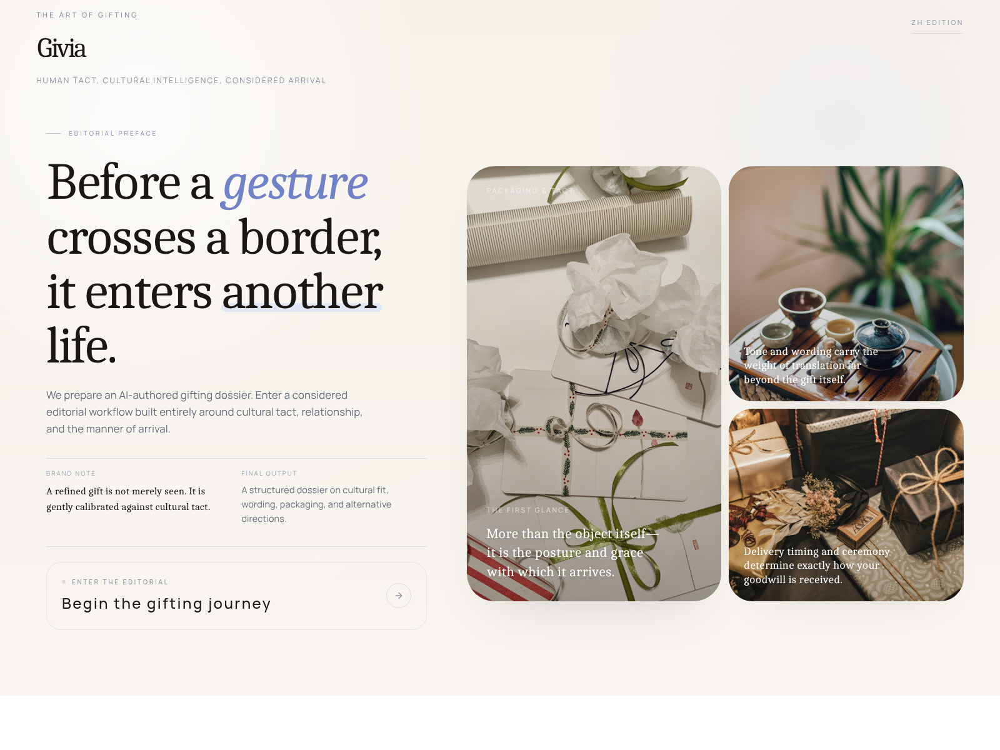
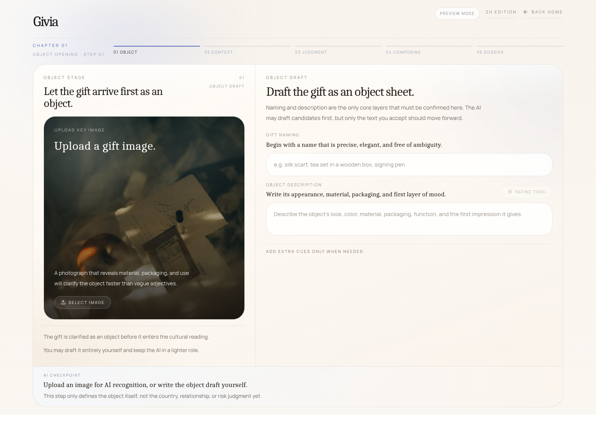
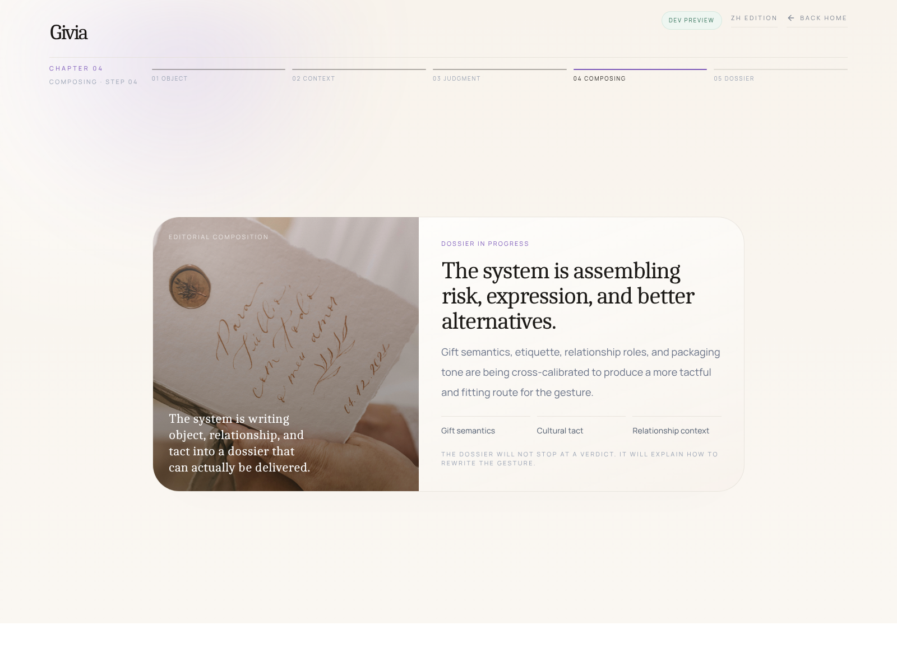

# Givia

<p align="center">
  <strong>Editorial intelligence for gestures that travel across cultures.</strong>
</p>

<p align="center">
  Givia is a bilingual cross-cultural gifting experience that helps a gesture arrive with more tact, more clarity, and more social intelligence.
</p>

<p align="center">
  <a href="./README_zh.md">中文文档</a> ·
  <a href="https://github.com/zzemy/GIVIA/actions">Actions</a>
</p>

<p align="center">
  <a href="https://github.com/zzemy/GIVIA/actions/workflows/ci.yml">
    
  </a>
  <a href="https://github.com/zzemy/GIVIA/actions/workflows/deploy-pages.yml">
    
  </a>
  
  
  
  
</p>

<p align="center">
  
</p>

<p align="center">
  
  
</p>

<p align="center">
  
  
</p>

<p align="center">
  <em>Landing, workflow, and dossier-like composition across Chinese and English product surfaces.</em>
</p>

---

## Before a gift is accepted, it is interpreted

A gift rarely arrives as an object alone.

It arrives with implication, etiquette, hierarchy, distance, timing, and tone already attached. What feels thoughtful in one place may feel excessive, awkward, too intimate, too public, or simply out of tune in another.

**Givia exists to read that difference before the gesture is sent.**

It does not treat gifting as a generic recommendation task. It treats it as an **editorial judgment problem** — something that must be framed, interpreted, revised, and delivered with tact.

## Why this product matters

Most gifting tools are built around one narrow question:

> what should I buy?

But cross-cultural gifting is rarely just a buying problem.

It is a problem of:

- social distance,
- cultural reading,
- symbolic risk,
- expression style,
- and delivery posture.

The same object can signal warmth, pressure, ceremony, overfamiliarity, or poor judgment depending on who receives it, where it is received, and how it is presented.

Givia is built for that layer.

## What makes Givia different

- **Not marketplace-first**  
  It is not designed as a catalog or shopping interface.

- **Not just a taboo checker**  
  It does more than list cultural risks or symbolic warnings.

- **Not generic AI recommendation**  
  It does not simply output a ranked list of gift ideas.

- **Editorial by design**  
  It rewrites the gifting decision as a composed narrative: object, recipient, context, tact, and final arrival.

- **Bilingual as a product surface**  
  Chinese and English are both treated as first-class brand experiences.

- **Premium in tone and presentation**  
  The interface, copy, and final report are designed to feel calm, deliberate, and internationally credible.

## What the user gets

The output is not just an answer.

It is a **dossier-like gifting document** that can include:

- gift recognition from image or text,
- recipient and relationship framing,
- cultural risk reading,
- tone and tact judgment,
- alternative gifting directions,
- packaging and delivery guidance,
- and rewritten wording that feels more suitable for the situation.

In other words: Givia helps transform a gift from an object into a better-arriving gesture.

## Experience surfaces

| Surface | Route | Role |
| --- | --- | --- |
| Brand entry | `/` | Shared entry into the product world |
| Localized home | `/zh`, `/en` | Language-specific landing surfaces |
| Editorial gifting flow | `/[locale]/gifting` | Main multi-step workflow |
| Final dossier | Inside the gifting flow | Structured recommendation and rewrite output |

## Current workflow

The product is currently organized into five visible chapters:

1. **Object opening**  
   Understand the gift itself from image or text.

2. **Recipient writing**  
   Write the recipient clearly — relationship distance, profile, and tact.

3. **AI judgment**  
   Organize the cultural reading, delivery logic, and expression direction.

4. **Composing**  
   Generate the final report-like output.

5. **Final dossier**  
   Present the recommendation as a composed gifting document rather than a flat result list.

## Core capabilities

| Capability | Description |
| --- | --- |
| Gift recognition | Read a gift candidate from image or text |
| Cultural interpretation | Evaluate etiquette, symbolism, and cross-market sensitivity |
| Recipient framing | Model the recipient, relationship, and contextual distance |
| Editorial rewriting | Suggest more tactful alternatives and better wording |
| Delivery guidance | Extend recommendations into packaging and logistics |
| Bilingual presentation | Preserve a coherent Chinese and English product voice |

## Tech stack

- Next.js 16 App Router
- React 19
- TypeScript
- Tailwind CSS v4
- Framer Motion
- Jest + Testing Library
- GitHub Actions
- Optional Tauri wrapper in `src-tauri/`

## Project structure

```text
.
├── app/
│   ├── [locale]/
│   │   ├── page.tsx
│   │   └── gifting/page.tsx
│   ├── api/
│   │   ├── analysis/run/route.ts
│   │   ├── cultural-generate/route.ts
│   │   ├── logistics-assistant/route.ts
│   │   ├── text-refine/route.ts
│   │   └── vision-recognize/route.ts
│   └── page.tsx
├── components/
├── lib/
├── public/
└── src-tauri/
```

## Run locally

```bash
pnpm install
pnpm dev
```

Open `http://localhost:3000`.

## Available scripts

```bash
pnpm dev
pnpm build
pnpm start
pnpm lint
pnpm test
pnpm test:watch
pnpm test:coverage
```

## API routes

| Method | Route | Purpose |
| --- | --- | --- |
| `POST` | `/api/analysis/run` | Run the end-to-end gifting analysis pipeline |
| `POST` | `/api/vision-recognize` | Read a gift candidate from image or text |
| `POST` | `/api/cultural-generate` | Generate cultural guidance and editorial suggestions |
| `POST` | `/api/logistics-assistant` | Return logistics and delivery guidance |
| `POST` | `/api/text-refine` | Refine drafted workflow text |

## Environment variables

Create `.env.local` in the project root.

| Variable | Required | Default |
| --- | --- | --- |
| `ALIYUN_DASHSCOPE_API_KEY` | Required for AI-backed routes | - |
| `ALIYUN_DASHSCOPE_BASE_URL` | No | `https://dashscope.aliyuncs.com/compatible-mode/v1` |
| `ALIYUN_DASHSCOPE_VISION_MODEL` | No | `qwen-vl-plus-latest` |
| `ALIYUN_DASHSCOPE_TEXT_MODEL` | No | `qwen-plus-latest` |

Without the API key, AI-backed server routes will fail by design.

## Deployment note

The project currently uses static export for the shell (`output: "export"`), which means:

- GitHub Pages can host the static product surface
- GitHub Pages cannot execute Next.js server route handlers
- `/api/*` features require a server-capable deployment target

So Pages is suitable for the static brand and workflow shell, but not for the full live AI-backed behavior.

## Brand

**Givia** is the global-facing brand.

In Chinese contexts, the product also appears as **礼智极意** — a localized expression of the same editorial and cross-cultural positioning.

## License

GNU Affero General Public License v3.0 (AGPL-3.0)
