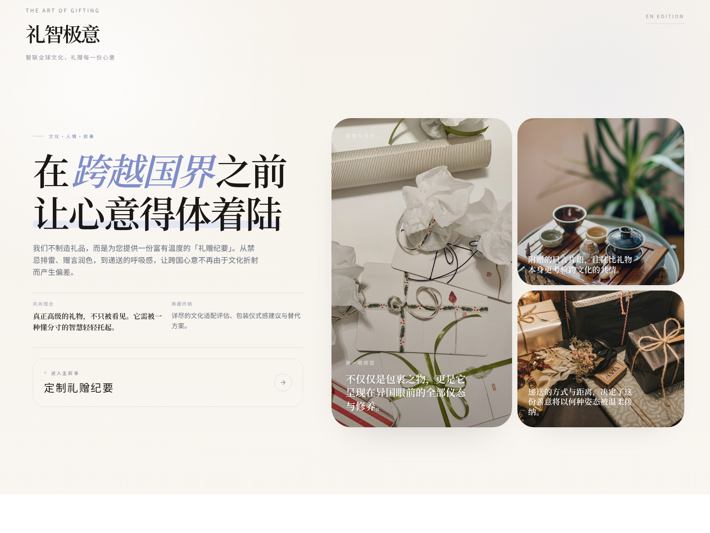
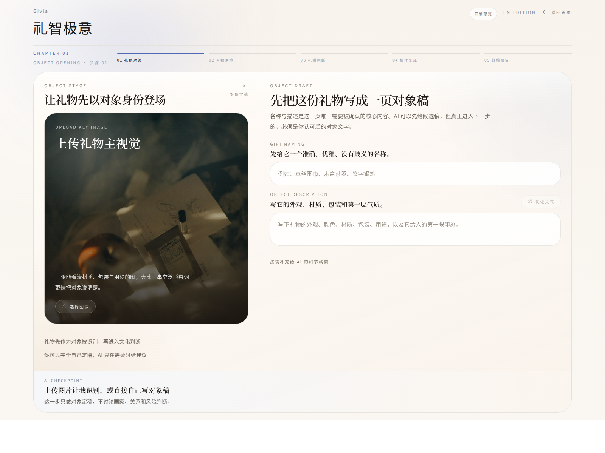
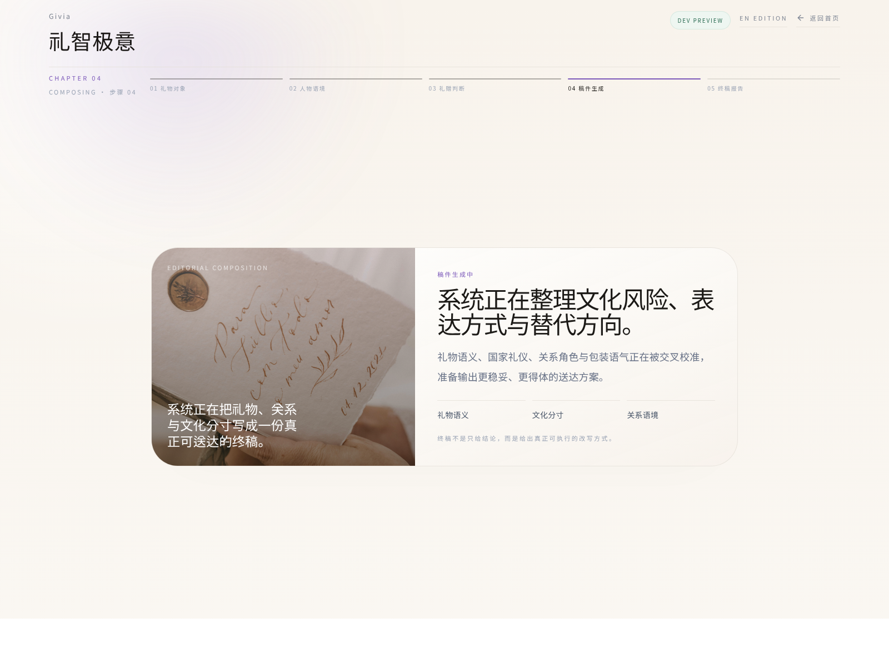

# Givia

<p align="center">
  <strong>为跨文化送达的心意，提供带有判断力的编辑式智能。</strong>
</p>

<p align="center">
  Givia 是一个双语的跨文化礼赠产品，帮助一份心意以更得体、更清楚、更有分寸的方式抵达。
</p>

<p align="center">
  <a href="./README.md">English</a> ·
  <a href="https://github.com/zzemy/GIVIA/actions">GitHub Actions</a>
</p>

<p align="center">
  <a href="https://github.com/zzemy/GIVIA/actions/workflows/ci.yml">
    
  </a>
  <a href="https://github.com/zzemy/GIVIA/actions/workflows/deploy-pages.yml">
    
  </a>
  
  
  
  
</p>

<p align="center">
  
</p>

<p align="center">
  
  
</p>

<p align="center">
  <em>中文首页、礼赠流程与终稿生成界面。</em>
</p>

## 运行模式

Givia 有两种运行方式：

- **Web 模式**：`pnpm dev` 启动 Next.js，本地地址为 `http://localhost:3000`
- **桌面模式**：`pnpm tauri dev` 以原生窗口运行同一套应用
- **生产构建**：`pnpm build` 生成静态 `out/` 目录，供 Tauri 和静态托管使用

当前项目在 `next.config.ts` 中启用了 `output: "export"`，因此生产壳层是静态导出的。

---

## 在一份礼物被接受之前，它会先被理解

一份礼物真正抵达时，从来不只是一个物件本身。

它会连同关系、礼仪、身份距离、文化联想、时间节点与表达方式一起被接收。一个在本地语境里显得自然得体的选择，换到另一种文化之中，可能会被理解为过界、失衡、过度亲密，甚至完全不合时宜。

**Givia 的价值，就在于在心意被送出之前，先读懂这种差异。**

它不把礼赠理解为普通推荐问题，而是把它视为一个需要被 framing、被理解、被修订、被改写并最终妥帖送达的**编辑式判断问题**。

## 为什么这个产品值得存在

大多数送礼工具只回答一个问题：

> 我应该买什么？

但跨文化送礼很少只是“买什么”的问题。

它更深层地是一个关于以下内容的判断问题：

- 关系距离
- 文化语境
- 象征意义
- 表达方式
- 送达姿态

同样一件礼物，面对不同的人、不同的国家、不同的关系位置、不同的送达方式，会被读成完全不同的信号。

Givia 就是为这一层而做的。

## Givia 的不同之处

- **不是商城优先**  
  它不是一个商品目录或购物界面。

- **不是只有禁忌检测**  
  它不只是告诉你哪里不合适。

- **不是泛化 AI 推荐**  
  它不满足于给出一串排序后的礼物建议。

- **从一开始就是编辑式产品**  
  它把礼赠流程重写成一条完整叙事：礼物、人物、语境、分寸与最终抵达。

- **双语本身就是产品表面**  
  中文与英文都不是附属翻译，而是正式的品牌体验。

- **强调高级感与可信度**  
  界面、语言和最终输出都被设计成更克制、更完整、更国际化的呈现。

## 用户最终拿到什么

Givia 最终交付的，不只是一个答案。

它更接近一份 **dossier 式的礼赠文稿**，其中可能包括：

- 基于图片或文本的礼物识别
- 收礼人和关系的建模
- 文化风险与象征意义解读
- 语气与分寸判断
- 替代方向建议
- 包装与送达建议
- 更适合当前场景的改写表达

也就是说，Givia 帮助用户把一件礼物，从“物”改写成一份更会抵达的心意。

## 当前产品表面

| 表面 | 路由 | 作用 |
| --- | --- | --- |
| 品牌入口 | `/` | 统一进入产品世界 |
| 本地化首页 | `/zh`、`/en` | 中文与英文首页 |
| 礼赠工作流 | `/[locale]/gifting` | 主流程：识别、建模、判断、生成 |
| 终稿 dossier | 流程内部 | 以报告式结构呈现最终输出 |

## 当前流程结构

当前产品分成五个可见章节：

1. **Object opening**  
   先理解礼物本身，可从图片或文本进入。

2. **Recipient writing**  
   写清收礼人、关系距离与人物语境。

3. **AI judgment**  
   组织文化判断、送达逻辑与表达方向。

4. **Composing**  
   生成接近终稿的报告式输出。

5. **Final dossier**  
   以完整礼赠文稿的方式呈现最终建议，而不是扁平结果列表。

## 核心能力

| 能力 | 说明 |
| --- | --- |
| 礼物识别 | 从图片或文本读取礼物候选 |
| 文化解读 | 评估礼仪、象征意义与跨市场敏感度 |
| 对象建模 | 把收礼人、关系与语境距离纳入判断 |
| 编辑式改写 | 提出更得体的替代方向与表达建议 |
| 送达指导 | 将建议延伸到包装与物流层面 |
| 双语产品表面 | 在中英两个语境下保持统一体验表达 |

## 技术栈

- Next.js 16 App Router
- React 19
- TypeScript
- Tailwind CSS v4
- Framer Motion
- Jest + Testing Library
- GitHub Actions
- `src-tauri/` 下的 Tauri v2 桌面封装

## 本地资源

首页与礼赠流程中使用的编辑风格图片已经统一放在 `public/editorial/` 下，避免外链图片失效。

## 目录结构

```text
.
├── app/
│   ├── [locale]/
│   │   ├── page.tsx
│   │   └── gifting/page.tsx
│   ├── api/
│   │   ├── analysis/run/route.ts
│   │   ├── cultural-generate/route.ts
│   │   ├── logistics-assistant/route.ts
│   │   ├── text-refine/route.ts
│   │   └── vision-recognize/route.ts
│   └── page.tsx
├── components/
│   ├── gifting/
│   │   ├── home/
│   │   └── mobile/
│   └── ui/
├── lib/
├── public/
│   └── editorial/
└── src-tauri/
```

## 本地运行

```bash
pnpm install
pnpm dev
```

打开 `http://localhost:3000`。

如果要运行桌面端：

```bash
pnpm tauri dev
```

## 可用脚本

```bash
pnpm dev
pnpm build
pnpm start
pnpm lint
pnpm test
pnpm test:watch
pnpm test:coverage
```

## API 路由

| 方法 | 路由 | 作用 |
| --- | --- | --- |
| `POST` | `/api/analysis/run` | 执行完整礼赠分析流程 |
| `POST` | `/api/vision-recognize` | 从图片或文本识别礼物候选 |
| `POST` | `/api/cultural-generate` | 生成文化建议与编辑式提案 |
| `POST` | `/api/logistics-assistant` | 提供物流与配送建议 |
| `POST` | `/api/text-refine` | 对流程中的文案草稿进行润色 |

## 环境变量

在项目根目录创建 `.env.local`：

| 变量名 | 是否必填 | 默认值 |
| --- | --- | --- |
| `ALIYUN_DASHSCOPE_API_KEY` | AI 路由必填 | - |
| `ALIYUN_DASHSCOPE_BASE_URL` | 否 | `https://dashscope.aliyuncs.com/compatible-mode/v1` |
| `ALIYUN_DASHSCOPE_VISION_MODEL` | 否 | `qwen-vl-plus-latest` |
| `ALIYUN_DASHSCOPE_TEXT_MODEL` | 否 | `qwen-plus-latest` |

如果没有 API Key，依赖 AI 的服务端路由会按设计直接失败。

## 部署说明

项目当前使用静态导出壳层（`output: "export"`），这意味着：

- GitHub Pages 可以承载静态产品界面
- GitHub Pages 不能执行 Next.js 服务端路由处理器
- `/api/*` 功能必须部署到具备服务端能力的平台

因此，Pages 适合承载静态品牌与流程壳层，不适合作为完整 AI 能力的生产环境。

Tauri 构建同样依赖生成出来的 `out/` 目录，所以打包前需要先确保 `pnpm build` 成功。

## 品牌说明

**Givia** 是国际主品牌名。

在中文语境中，产品同时以 **礼智极意** 作为本地化品牌表达出现，两者共同指向同一套编辑式、跨文化的产品定位。

## 许可证

GNU Affero General Public License v3.0（AGPL-3.0）
